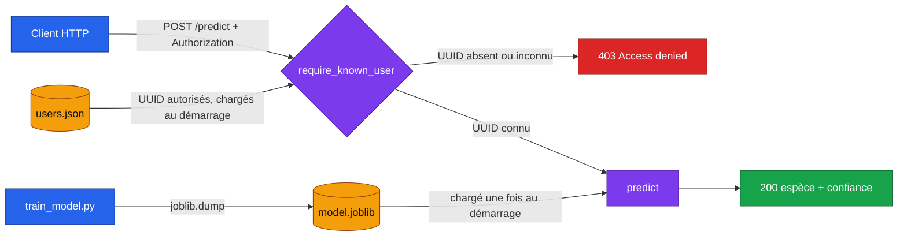

# Iris API sécurisée

   

Exercice 5 des révisions S3 du module MLOps (M2 Data Engineering et IA, EFREI) : packager un modèle dans un web service et le protéger par identifiant. Le code est commenté ligne par ligne, et chaque fichier correspond à une étape de l'énoncé.

## Architecture



| Fichier | Étape | Rôle |
|---|---|---|
| `train_model.py` | 1 et 2 | Entraîne une régression logistique sur iris et la sauvegarde avec joblib |
| `users.json` | 4 | Fausse base d'utilisateurs, une liste d'UUID autorisés |
| `app.py` | 3 et 4.1 | API FastAPI, `/predict` protégé par l'en-tête `Authorization` |
| `test_api.py` | 3 et 4.2 | 9 tests : UUID valide donne 200, sans UUID ou UUID inconnu donne 403 |

## Lancer

```bash
pip install -r requirements.txt
python train_model.py              # crée model.joblib (accuracy 0.967)
python -m pytest -v                # 9 tests
python -m uvicorn app:app --port 8000
```

Doc interactive sur http://127.0.0.1:8000/docs.

## Tester à la main

```bash
# UUID valide : 200 et la prédiction
curl -X POST http://127.0.0.1:8000/predict \
  -H "Authorization: 3f8b2c1e-7a4d-4e5f-9b6a-1c2d3e4f5a6b" \
  -H "Content-Type: application/json" \
  -d '{"sepal_length":6.7,"sepal_width":3.0,"petal_length":5.2,"petal_width":2.3}'
# {"y_pred":2,"species":"virginica","confidence":0.9074,...}

# Sans en-tête ou avec un UUID inconnu : 403 {"detail":"Access denied"}
```

## Points à retenir

- **Le modèle est chargé une fois**, au démarrage (`lifespan`), et pas à chaque requête.
- **L'authentification est une dépendance FastAPI** (`Depends`). Elle s'exécute avant la route, donc `/predict` ne voit jamais un appelant refusé.
- **403 plutôt que 401.** L'énoncé demande 403. En HTTP strict, 401 veut dire « pas identifié » (avec un en-tête `WWW-Authenticate`) et 403 veut dire « identifié mais pas autorisé ».
- **Même réponse pour tous les refus.** Un appelant refusé ne sait pas si c'est le format ou l'identifiant qui coince.
- **422 n'est pas 403.** Une requête authentifiée mais mal formée est refusée par Pydantic, pas par l'authentification.
- **Limite.** Un UUID fixe envoyé en clair n'est pas un vrai secret. En production il faudrait du HTTPS, des jetons qui expirent (JWT) et une vraie base.
